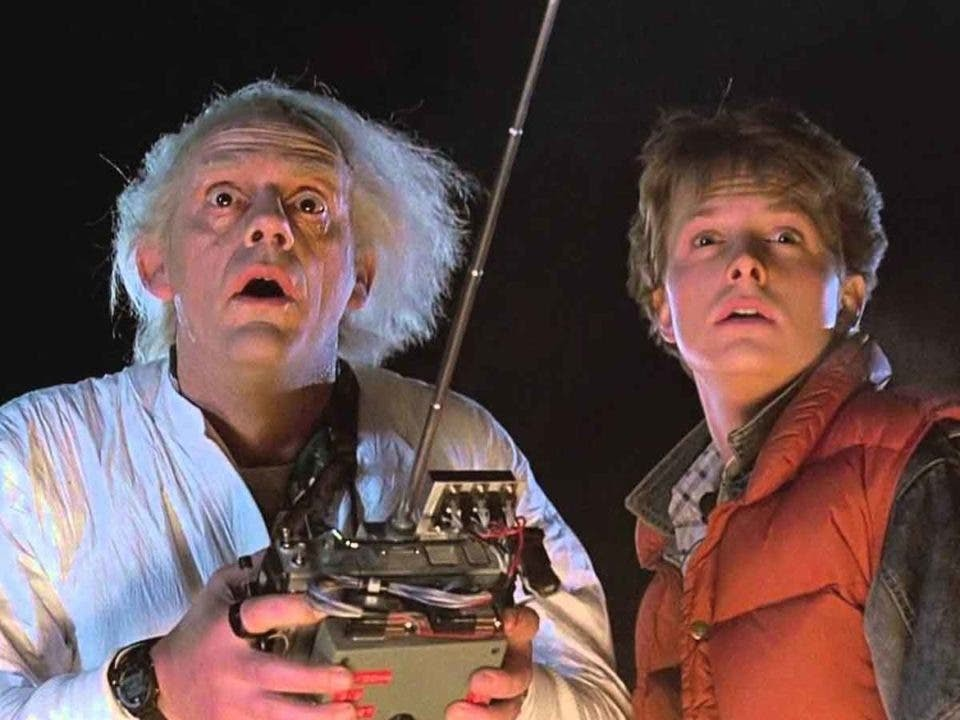

# Volver Al Futuro

## Clases e instanciación

**Hoy nos sumergimos en los viajes en el tiempo, veremos cómo se comportan los distintos viajeros, los elementos que van perdiendo en cada viaje y como es que hacen para viajar.**

[Para escuchar mientras resuelven el problema](https://open.spotify.com/playlist/7sXTwC7UZe4DptQrwi9qgL)

[Enunciado completo](https://docs.google.com/document/d/1aQzO3qtmF8J-_GJ3HDyGmHIb8UBxDsm3ZRw0nw3cVvE/edit)
